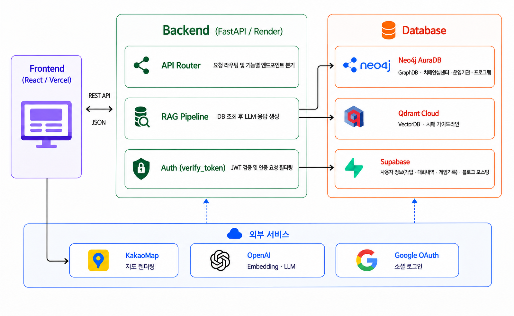
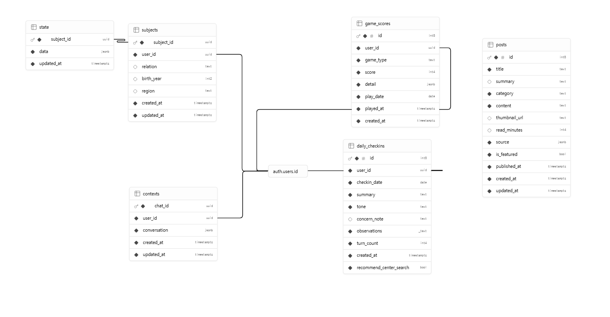
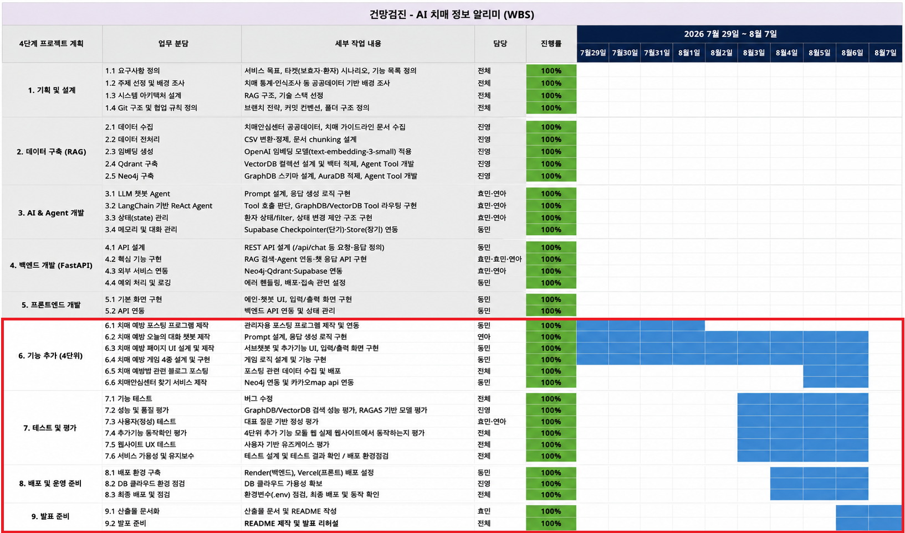
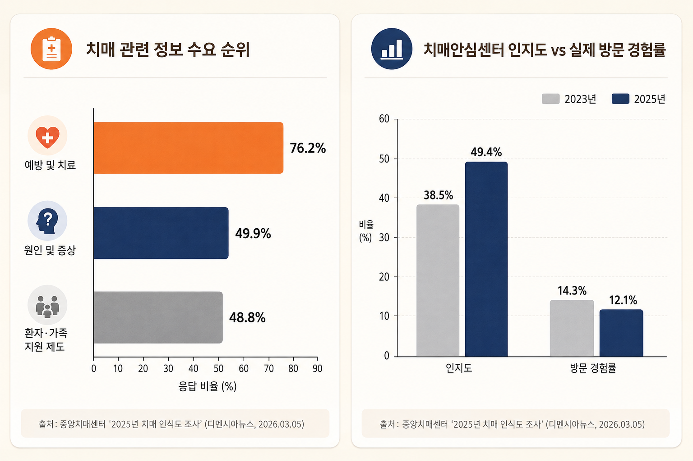
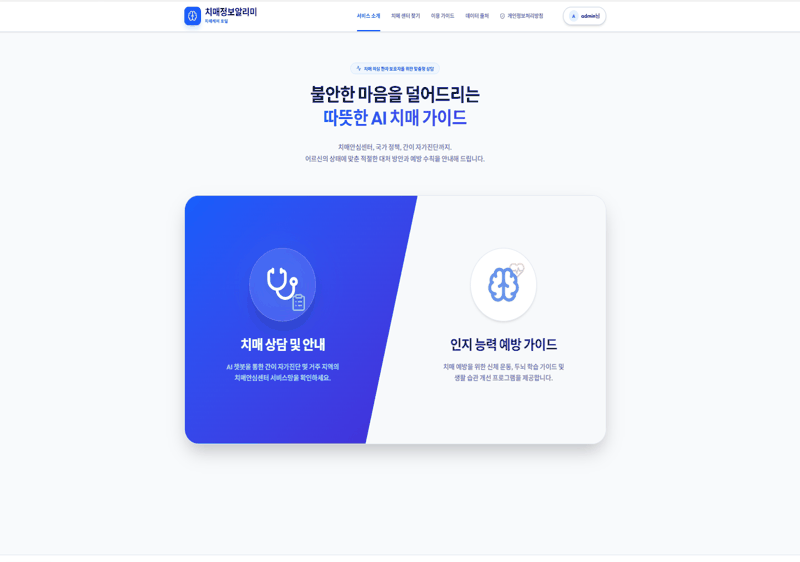

# SKN31-3rd-1Team

<br>

# 1. 팀 및 팀원 소개


### 1.1 팀 명
<!-- TODO -->
<center><h3><b> Team | 📋건망검진  </b></h3></center>

---

### 1.2 팀원 및 담당업무
<table align="center" style="width:100%; table-layout:fixed; text-align:center;">
  <tr>
    <th style="width:50%;">김효민</th>
    <th style="width:50%;">유진영</th>
    <th style="width:50%;">박연아</th>
    <th style="width:50%;">김동민</th>
  </tr>
  <tr>
    <td><a href="https://github.com/hyomin0357"></a></td>
    <td><a href="https://github.com/ujneg18-source"></a></td>
    <td><a href="https://github.com/yeona9549"></a></td>
    <td><a href="https://github.com/여기에_김동민_깃허브아이디"></a></td>
  </tr>
  <tr>
    <td> </td>
    <td></td>
    <td></td>
    <td></td>
  </tr>
  <tr>
    <td><b>PM · 데이터</b><br><sub>데이터 수집 및 포스팅</sub><br><sub>산출물 총괄</sub></td>
    <td><b>GraphDB · 데이터</b><br><sub>GraphDB · VectorDB 설계</sub><br><sub>데이터 수집 및 포스팅</sub></td>
    <td><b>백엔드</b><br><sub>오늘의 대화 챗봇 로직 구현</sub><br><sub>데이터 수집 및 포스팅</sub></td>
    <td><b>프론트엔드</b><br><sub>웹UI 구현(센터지도, 치매 예방 게임)</sub><br><sub>백엔드 API 연동</sub></td>
  </tr>
</table>

---

### 1.3 기술 스택 🛠

<p>

<!-- Skill Icons -->

<br><br>

<!-- Backend & AI -->


<br>

<!-- Databases -->


<br>

<!-- Frontend & Deployment -->


 
 


</p>

---
### 1.4 시스템 아키텍쳐

<div align="center">

</div>
<br>
<details>
<summary><b>Supabase ERD</b></summary>

<br>

<div align="center">

</div>

## 1.4.1 🏗️ 테이블 관계도 (전체 구조 요약)

이 서비스는 "치매정보알리미"라는 하나의 앱인데, 로그인한 보호자가 할 수 있는 일이
크게 4가지다. **이 4가지가 그대로 4개의 테이블 그룹이 된다.**

| 사용자가 하는 일 | 관련 테이블 |
|---|---|
| ① "우리 엄마 요즘 이래요" 상담 챗봇과 대화 | `subjects`, `state`, `contexts` |
| ② 매일 짧게 "오늘 하루 어땠는지" 체크인 | `daily_checkins` |
| ③ 두뇌 게임(스도쿠 등) 플레이 | `game_scores` |
| ④ 예방 정보 게시글 읽기 | `posts` |

①~③은 전부 **"누가 썼는가"** 를 알아야 해서 로그인 사용자(`auth.users`)에 매달려
있다. ④는 관리자가 만들어 올리는 콘텐츠라 사용자와 무관하게 독립적으로 존재한다.

**표 읽는 법**: `키` 열에 `PK`는 그 행을 유일하게 식별하는 값(주민등록번호 같은
것), `FK`는 "다른 테이블의 어떤 행을 가리키는 값"이라는 뜻이다. 예를 들어
`subjects.user_id`가 `auth.users.id`의 FK라는 건 "이 대상자를 누가 등록했는지,
`auth.users`(로그인 계정) 쪽 id를 그대로 들고 있다"는 뜻이다. `nullable`은 비어있어도
되는 값이라는 뜻이다.

---

## 1. 관계 한눈에 보기

```
auth.users (구글/이메일로 로그인한 사용자 — Supabase가 자동 관리)
  │
  ├─ 1:N ──▶ subjects ── 1:1 ──▶ state       ① 상담 챗봇: "우리 엄마" 등록 → 파악된 증상
  ├─ 1:N ──▶ contexts                         ① 상담 챗봇: 대화 세션(요약 + 최근 대화)
  ├─ 1:N ──▶ daily_checkins                   ② 오늘의 대화: 하루에 최대 1행만 쌓임
  └─ 1:N ──▶ game_scores                      ③ 두뇌 게임: 플레이할 때마다 한 행씩 쌓임

posts                                          ④ 예방 콘텐츠 — 사용자와 연결선이 없다
                                                  (관리자가 올리는 글, 로그인 여부와 무관)
```

`1:N`은 "로그인 계정 하나가 이 테이블에 여러 행을 가질 수 있다"는 뜻이다. 예를 들어
게임은 몇 번을 하든 그때마다 `game_scores`에 새 행이 생기고, 오늘의 대화는 하루에
1행만 허용된다(같은 날 두 번 못 씀).

`state`만 좀 특이하게, `auth.users`가 아니라 `subjects`에 매달려 있다. 왜냐하면
상담의 대상이 **로그인한 본인이 아니라 그 사람의 가족(예: 어머니)** 이기 때문이다.
그래서 "누가 로그인했나"(`auth.users`) → "그 사람이 등록한 가족이 누구인가"
(`subjects`) → "그 가족의 지금 상태가 어떤가"(`state`) 순서로 한 단계씩 더 들어간다.

---

## 2. `subjects` — 우리 엄마 등록해두는 곳

보호자가 상담 챗봇에서 "저희 어머니가 요즘..." 하고 이야기를 시작하면, 그 어머니에
대한 기본 정보(관계, 나이, 사는 곳)가 여기 한 행으로 저장된다. 한 사람이 여러 명
(어머니, 아버지 등)을 등록할 수도 있다.

| 컬럼 | 타입 | 키 | 설명 |
|---|---|---|---|
| `subject_id` | uuid | PK | 이 대상자(가족)를 가리키는 고유 번호 |
| `user_id` | uuid | FK → `auth.users.id` | 이 사람을 등록한 보호자(로그인 계정) |
| `relation` | text | nullable | 사용자와의 관계. 예: "어머니", "아버지" |
| `birth_year` | int2 | nullable | 대상자 출생연도. 예: 1950 |
| `region` | text | nullable | 거주 지역. 예: "서울특별시 강남구" (센터 찾기와도 연결됨) |
| `created_at` | timestamptz | | 이 대상자를 처음 등록한 시각 |
| `updated_at` | timestamptz | | 정보를 마지막으로 고친 시각 |

## 3. `state` — 그 가족의 지금 상태 요약본

`subjects`에서 등록한 그 가족 한 명당 딱 1행만 존재한다(1:1). 상담하면서 AI가
파악한 증상·기간 같은 걸 여기에 정리해서 쌓아두고, 다음에 다시 상담할 때 "아, 전에
이런 얘기 하셨었죠"처럼 이어갈 근거로 쓴다.

| 컬럼 | 타입 | 키 | 설명 |
|---|---|---|---|
| `subject_id` | uuid | PK, FK → `subjects.subject_id` | 이 상태가 누구 것인지(대상자 1명당 1행뿐이라 PK를 겸함) |
| `data` | jsonb | | 증상·지속기간·위험신호 등을 한 덩어리로 담은 값. 예: `{"symptoms": ["반복질문"], "duration": "6개월"}` |
| `updated_at` | timestamptz | | 이 상태 정보가 마지막으로 갱신된 시각 |

## 4. `contexts` — 상담 챗봇과 나눈 대화 기록

사용자가 AI 상담 챗봇(`/prompt`)에서 대화를 시작하면 세션 하나가 여기 한 행으로
생긴다. 대화 원문을 그대로 다 쌓아두면 너무 커지니까, "요약 + 최근 대화 몇 마디"만
간추려서 저장한다.

| 컬럼 | 타입 | 키 | 설명 |
|---|---|---|---|
| `chat_id` | uuid | PK | 이 대화 세션을 가리키는 고유 번호 |
| `user_id` | uuid | FK → `auth.users.id` | 누구와의 대화인지 |
| `conversation` | jsonb | | 지금까지 대화 요약 + 최근 몇 턴. 예: `{"summary": "...", "recent": [...]}` |
| `created_at` | timestamptz | | 이 세션이 처음 시작된 시각 |
| `updated_at` | timestamptz | | 가장 최근에 대화가 오간 시각 |

## 5. `daily_checkins` — 오늘 하루 어땠는지 짧게 체크인한 기록

예방 탭 맨 위에 있는 "오늘의 대화" 위젯에서 나온 결과다. 로그인 사용자가 AI와
3~5턴 정도 짧게 대화하고 나면, 그 대화를 AI가 요약해서 여기 **하루에 딱 1행만**
쌓는다(같은 날 두 번은 못 씀 — DB가 막아준다).

| 컬럼 | 타입 | 키 | 설명 |
|---|---|---|---|
| `id` | int8 | PK, 자동증가 | 이 체크인 기록의 고유 번호 |
| `user_id` | uuid | FK → `auth.users.id` | 누가 체크인했는지 |
| `checkin_date` | date | `(user_id, checkin_date)`가 함께 UNIQUE | 체크인한 날짜. 하루 1행 제한의 기준이 되는 값 |
| `summary` | text | | 그날 대화를 AI가 한 문단으로 요약한 것. 예: "오늘은 편안하게 지내셨고..." |
| `tone` | text | | AI가 판단한 4단계 중 하나: `reassure`(안심)/`neutral`(보통)/`observe`(관찰 권함)/`suggest_consult`(상담 권유) |
| `concern_note` | text | nullable | tone을 그렇게 정한 이유. `reassure`/`neutral`이면 보통 빈 값 |
| `observations` | 텍스트 배열 | | 대화 중 눈에 띈 키워드들. 예: `["산책", "수면 부족"]` |
| `recommend_center_search` | bool, default `false` | | 치매센터찾기(`/center-search`) 페이지 링크를 보여줄지. `tone`이 `suggest_consult`일 때만 `true` 가능하고, 그 안에서도 AI가 "정말 필요한 경우"로 판단할 때만 켜진다(예: 이미 병원 진료 중이면 false) |
| `turn_count` | int4 | | 그날 몇 마디나 주고받았는지 |
| `created_at` | timestamptz | | 이 체크인이 저장된 시각 |

## 6. `game_scores` — 두뇌 게임 플레이 기록

스도쿠·카드 짝 맞추기 같은 두뇌 게임을 한 판 끝낼 때마다 여기 한 행씩 쌓인다.
하루에 여러 번 해도 되고, 통계 페이지에서 이 기록들을 모아 그래프로 보여준다.

| 컬럼 | 타입 | 키 | 설명 |
|---|---|---|---|
| `id` | int8 | PK, 자동증가 | 이 플레이 기록의 고유 번호 |
| `user_id` | uuid | FK → `auth.users.id` | 누가 플레이했는지 |
| `game_type` | text | 정해진 값만 허용 | 어떤 게임인지. 예: `puzzle`(스도쿠), `sequence`, `card_match`, `color_match` |
| `score` | int4 | | 그 판의 점수 (게임마다 의미가 다름 — 스도쿠는 시간이 짧을수록 좋은 거라 반대) |
| `detail` | jsonb | | 게임별 부가 정보. 예: `{"duration_sec": 320, "difficulty": "medium"}` |
| `play_date` | date | | 플레이한 날짜(한국 시간 기준으로 정확히 저장) |
| `played_at` | timestamptz | | 정확히 몇 시 몇 분에 플레이했는지 |
| `created_at` | timestamptz | | 이 기록이 저장된 시각 |

## 7. `posts` — 예방 정보 게시글 (사용자와 무관한 독립 테이블)

관리자가 미리 써서 올려두는 예방 정보 글이다. 로그인 여부와 상관없이 누구나 읽을 수
있고, 사용자별로 다른 게 아니라 모두에게 똑같이 보이는 콘텐츠라 `user_id` 컬럼
자체가 없다.

| 컬럼 | 타입 | 키 | 설명 |
|---|---|---|---|
| `id` | int8 | PK, 자동증가 | 게시글 고유 번호 |
| `title` | text | | 제목 |
| `summary` | text | nullable | 목록에서 보이는 짧은 요약 |
| `category` | text | | 분류. 예: "식습관", "운동", "수면" |
| `content` | text | | 본문 내용(마크다운 형식) |
| `thumbnail_url` | text | nullable | 목록에 보이는 대표 이미지 주소 |
| `read_minutes` | int4 | nullable | 읽는 데 걸리는 예상 시간(분) |
| `source` | jsonb | | 이 글의 원본 출처 정보 |
| `is_featured` | bool | | 예방 탭 맨 위 "오늘의 추천"에 띄울지 여부 |
| `published_at` | timestamptz | | 게시된 시각(목록 정렬 기준) |
| `created_at` | timestamptz | | 이 글이 처음 만들어진 시각 |
| `updated_at` | timestamptz | | 마지막으로 수정된 시각 |

---

## 8. 누가 이 테이블에 쓰기(저장)를 하는가 — 의외로 다 다르다

같은 "사용자 데이터"처럼 보여도, 실제로 누가 그 값을 DB에 써넣는지는 테이블마다
다르다. 헷갈리기 쉬운 부분이라 따로 짚어둔다.

| 테이블 | 누가 저장하나 | 왜 그런가 |
|---|---|---|
| `subjects`, `state` | 서버(백엔드)가 대신 씀 | 상담 중 AI가 알아낸 정보를 서버가 한 번 걸러서(검증해서) 넣기 때문 |
| `contexts` | 서버(백엔드)가 대신 씀 | 대화를 요약해서 압축하는 것도 서버 로직 |
| `daily_checkins` | 서버(백엔드)가 대신 씀 | AI 요약을 만든 뒤에 저장하는 순서라서 |
| `game_scores` | **프론트엔드(브라우저)가 직접 씀** | 그냥 점수 기록이라 AI나 서버가 개입할 필요가 없음 |
| `posts` | 서버의 관리자 전용 기능만 | 아무나 글을 쓰면 안 되니까, 일반 사용자(프론트)는 쓰기 자체가 막혀 있음 |

그리고 자기 것만 볼 수 있게 하는 보안 장치(RLS)가 `game_scores`, `subjects`,
`state`, `contexts`, `daily_checkins`에 다 걸려 있다 — "내 로그인 계정으로는 내
기록만 보이고, 남의 기록은 아예 조회조차 안 된다"는 뜻이다. `posts`는 반대로 읽기는
누구에게나 공개하고, 쓰기만 관리자 전용으로 막아둔다.

</details>

### 1.5 WBS

<details>
<summary>펼치기</summary>

<div align="center">

</div>

</details>

---

## 2. 프로젝트 개요

### 2.1 프로젝트명
- AI 치매 정보 알리미
- https://dementia-front.vercel.app/

### 2.2 주제

**3차에서 구축한 "LLM을 연동한 내·외부 문서 기반 질의 응답 시스템"(GraphDB/VectorDB
기반 RAG 챗봇)을 실제 사용 가능한 웹 서비스로 고도화한다.** 3차가 챗봇 코어(에이전트,
GraphDB, VectorDB)를 완성하는 데 집중했다면, 4차는 그 코어를 감싸는 **회원 관리, 예방
콘텐츠, 두뇌 게임, 센터 찾기 지도, 자기관리 저널(오늘의 대화)까지 갖춘 하나의 완결된
서비스**로 확장하는 것이 목표다.

### 2.3 배경 및 선정 이유

<div align="center">

</div>
<br>

- 3차 프로젝트에서 검증한 RAG 챗봇의 핵심 가치(정확한 정보 안내)는 그대로 유지하되,
  실제 보호자가 서비스를 "쓸 이유"를 넓히는 데 집중했다. 상담만 하고 끝나는 게 아니라,
  상담 이후 실제 행동(센터 방문, 예방 활동, 꾸준한 기록)으로 이어지도록 기능을 설계했다.

- 중앙치매센터 조사에서 확인된 문제의식(3차 README 2.3절 참고 — 치매안심센터 **인지도**
  49.4% 대비 **실제 방문 경험률** 12.1%)을 4차에서 한 단계 더 풀었다. "안다"에서
  "가본다"로 이어지는 간극을 좁히기 위해 **치매 센터 찾기** 기능을 새로 만들어,
  상담에서 언급된 지역을 실제 지도 위 가까운 센터로 바로 연결한다.

- 예방(76.2%)·원인/증상(49.9%) 정보 수요가 크다는 점에 착안해, 상담 챗봇 하나에
  머무르지 않고 **예방 콘텐츠 · 두뇌 게임 · 오늘의 대화(자기관리 저널)** 를 더해 사용자가 주기적으로 돌아오는 서비스로 설계했다. 3차는 랜딩 페이지와 AI 상담 챗봇뿐이었고, 이 세 축은 전부 4차에서 처음 만들었다.

<br>               

### 2.4 주요 기능 및 요구사항
| 구분 | 기능 | 설명 |
|------|------|------|
| **메인** | 서비스 랜딩 | 치매 정보 알리미 및 예방 플랫폼 소개 |
| **계정** | 계정 관리 | 회원가입, 탈퇴, 비밀번호 수정 등 회원정보 관리 |
| **정보** | 치매 예방 정보 제공 | 일상생활 수칙, 식습관, 운동, 수면 등 카테고리별 건강 정보 제공 |
| **정보**| 추천 게시물 | 관리자가 지정한 주요 게시물을 추천 탭 상단 배너에 노출하는 기능 |
| **관리자**| 정보 포스트 관리 | 치매 예방 관련 정보 및 포스팅 콘텐츠를 등록하고 관리 |
| **게임**| 치매 예방 게임 | 뇌 활성화를 위한 인지 기능 향상 게임 제공 |
| **게임**| 내 게임 기록 차트 | 사용자별 기록을 시각적 차트로 제공하여 인지 변화 추이 관리 |
| **서비스**| 치매센터 찾기 | 사용자 위치 기반/지역 검색을 통한 전국 치매안심센터 위치, 연락처 및 프로그램 정보 안내 |
| **건강**| 오늘의 체크 | 일상의 특이사항을 기록/점검하는 데일리 체크리스트 |

<br>

## 3. UI / 화면 구성

- [화면정의서](https://sknetworks-family-aicamp.github.io/SKN31-4th-1Team/산출물/화면정의서.html)

- 실행화면

  


---
## 4. 디렉토리 구조

```
SKN31-4th-1Team/
├── .env                          # 환경변수 (API 키, DB 접속 정보 — git 미포함)
├── .gitignore
├── config.py                     # 프로젝트 전역 설정 상수 (모델명, 경로, DB 접속 정보 등)
├── eval.ipynb                    # RAGAS / 성능 평가용 Jupyter Notebook
├── README.md
├── requirements.txt
├── server.bat                    # 메인 실행 스크립트
├── UVon.bat                      # Virtualenv / UV 환경 활성화 스크립트
├── git_auto_uploader.bat         # Git 자동 업로드 스크립트
├── 통신 규격.md                  # 백엔드/프론트엔드 API 통신 명세서
│
├── graph_db/                     # GraphDB(Neo4j) 관련 코드 (크롤링/적재/TOOL)
│   ├── __init__.py
│   ├── cypher_prompt.py          # Cypher 쿼리 생성용 프롬프트 관리
│   ├── graph_search_tool.py      # Neo4j 그래프 검색 툴
│   ├── load_to_aura.py           # Neo4j Aura DB 데이터 적재
│   ├── preprocess.py             # 그래프 데이터 전처리
│   └── data/
│       
├── modules/                      # LangGraph 파이프라인 (에이전트, State, 그래프 구성)
│   ├── __init__.py
│   ├── agent.py                  # LangGraph 코어 파이프라인
│   └── extractor.py              # 엔티티 추출 모듈
│
├── server/                       # FastAPI 서버
│   ├── __init__.py
│   ├── agent.py                  # LangGraph 기반 ReAct 에이전트 및 프롬프트 로직
│   ├── auth.py                   # 사용자 인증 및 권한 관리
│   ├── context_loader.py         # 대화 컨텍스트 및 DB 데이터 로딩
│   ├── extractor.py              # 주관식 응답 데이터(엔티티) 추출 모듈
│   ├── family_tool.py            # 가족 관계 및 환자 기본 정보 조회 툴
│   ├── main.py                   # FastAPI 메인 애플리케이션 및 라우터
│   ├── server.bat                # 서버 실행(uvicorn) 스크립트
│   └── state_manager.py          # 세션 상태 및 Supabase 연동 관리
│
├── vector_db/                    # VectorDB(Qdrant) 관련 코드 (크롤링/적재/TOOL)
│   ├── __init__.py
│   ├── run_vector.py             # VectorDB 벡터화 및 임베딩 실행 스크립트
│   ├── vector_search_tool.py     # Qdrant 벡터 검색 툴
│   └── data/
│
└── 산출물/                       # 프로젝트 최종 산출물 및 문서
    ├── 데이터수집및전처리문서.md
    ├── 성능평가.md
    ├── 시스템아키텍쳐.md
    ├── 실행화면.md
    └── images/                   
```

---
## 5. 관련 문서

프로젝트의 상세한 정보 및 가이드는 아래 문서에서 확인하실 수 있습니다.

- [**📌 요구사항 정의서**](/산출물/요구사항정의서.md)
- [**🧩 화면 설계서**](/산출물/화면설계서.md)
- [**🏗️ 시스템 구성도**](/산출물/시스템아키텍쳐.md)
- [**📖 전체 테스트 계획서 및 테스트 결과보고서** ](/산출물/테스트설계및결과.md)
- [**📖 RAG성능평가** ](/산출물/성능평가.md)
- [**📖 데이터수집 및 전처리 문서** ](/산출물/데이터수집및전처리문서.md)

<br>

---
## 6. 회고

#### 구현 중 겪었던 문제와 해결 or 각자 느낀 점

#### 동민
- 

#### 연아
- 

#### 효민
- 

#### 진영
-

---

