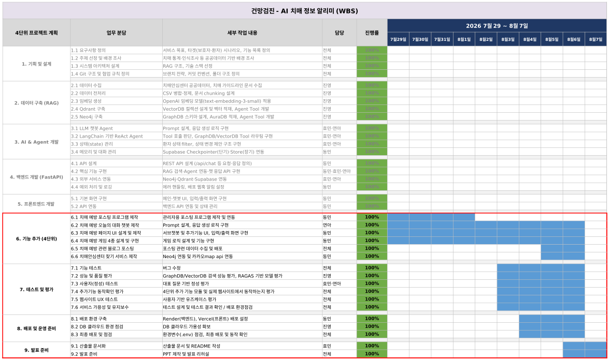

# SKN31-3rd-1Team

<br>

# 1. 팀 및 팀원 소개


### 1.1 팀 명
<!-- TODO -->
<center><h3><b> Team | 📋건망검진  </b></h3></center>

---

### 1.2 팀원 및 담당업무
| 유진영 | 박연아 | 김효민 | 김동민 |
| :---: | :---: | :---: | :---: |
| <a href="https://github.com/ujneg18-source"></a> | <a href="https://github.com/yeona9549"></a> | <a href="https://github.com/hyomin0357"></a> | <a href="https://github.com/hyomin0357"></a> |
|  |  |  |  |
| **GraphDB 설계**<br><sub>데이터 수집 및 전처리</sub><br><sub>Agent Tool 개발</sub> | **백엔드**<br><sub>LangGraph·AI Agent 설계</sub><br><sub>프롬프트 엔지니어링</sub> | **PM · 백엔드**<br><sub>LangGraph·AI Agent 설계</sub><br><sub>프롬프트 엔지니어링</sub> | **프론트엔드**<br><sub>웹UI 구현(챗봇 인터페이스)</sub><br><sub>백엔드 API 연동</sub> |

---

### 1.3 기술 스택 🛠

<p>

<!-- Skill Icons -->

<br><br>

<!-- Backend & AI -->


 
<br>

<!-- Databases -->


<br>

<!-- Frontend & Deployment -->


 
 


</p>

---

### 1.4 WBS

<div align="center">

</div>

---

## 2. 프로젝트 개요

### 2.1 프로젝트명
- AI 치매 정보 알리미
- https://dementia-front.vercel.app/

### 2.2 주제

**3차에서 구축한 "LLM을 연동한 내·외부 문서 기반 질의 응답 시스템"(GraphDB/VectorDB
기반 RAG 챗봇)을 실제 사용 가능한 웹 서비스로 고도화한다.** 3차가 챗봇 코어(에이전트,
GraphDB, VectorDB)를 완성하는 데 집중했다면, 4차는 그 코어를 감싸는 **회원 관리, 예방
콘텐츠, 두뇌 게임, 센터 찾기 지도, 자기관리 저널(오늘의 대화)까지 갖춘 하나의 완결된
서비스**로 확장하는 것이 목표다.

### 2.3 배경 및 선정 이유

<div align="center">

</div>
<br>

- 3차 프로젝트에서 검증한 RAG 챗봇의 핵심 가치(정확한 정보 안내)는 그대로 유지하되,
  실제 보호자가 서비스를 "쓸 이유"를 넓히는 데 집중했다. 상담만 하고 끝나는 게 아니라,
  상담 이후 실제 행동(센터 방문, 예방 활동, 꾸준한 기록)으로 이어지도록 기능을 설계했다.

- 중앙치매센터 조사에서 확인된 문제의식(3차 README 2.3절 참고 — 치매안심센터 **인지도**
  49.4% 대비 **실제 방문 경험률** 12.1%)을 4차에서 한 단계 더 풀었다. "안다"에서
  "가본다"로 이어지는 간극을 좁히기 위해 **치매 센터 찾기** 기능을 새로 만들어,
  상담에서 언급된 지역을 실제 지도 위 가까운 센터로 바로 연결한다.

- 예방(76.2%)·원인/증상(49.9%) 정보 수요가 크다는 점에 착안해, 상담 챗봇 하나에
  머무르지 않고 **예방 콘텐츠 · 두뇌 게임 · 오늘의 대화(자기관리 저널)** 를 더해 사용자가 주기적으로 돌아오는 서비스로 설계했다. 3차는 랜딩 페이지와 AI 상담 챗봇뿐이었고, 이 세 축은 전부 4차에서 처음 만들었다.
               
### 2.4 주요 기능 및 요구사항
| 구분 | 기능 | 설명 |
|------|------|------|
| **메인** | 서비스 랜딩 | 치매 정보 알리미 및 예방 플랫폼 소개 |
| **정보** | 치매 예방 가이드 | 일상생활 수칙, 식습관, 운동, 수면 등 카테고리별 건강 가이드라인 제공 |
| **게시판** | 목록 조회 | 커뮤니티에 작성된 예방 관련 정보 및 후기 리스트 렌더링 |
| **게시판** | 게시글 작성 | React Markdown 기반의 텍스트 에디터 및 폼 제공 |
| **게시판** | 수정/삭제 | 본인이 작성한 게시글에 대한 원활한 업데이트 및 삭제 기능 |
| **미디어**| 이미지 업로드 | 게시글 내 첨부 이미지 업로드 및 최적화 처리 |


## 예시 화면
## 화면
- [화면정의서](https://sknetworks-family-aicamp.github.io/SKN31-4th-1Team/산출물/화면정의서.html)


---


## 3. 디렉토리 구조

```
SKN31-4th-1Team/
├── .env                          # 환경변수 (API 키, DB 접속 정보 — git 미포함)
├── .gitignore
├── config.py                     # 프로젝트 전역 설정 상수 (모델명, 경로, DB 접속 정보 등)
├── eval.ipynb                    # RAGAS / 성능 평가용 Jupyter Notebook
├── README.md
├── requirements.txt
├── server.bat                    # 메인 실행 스크립트
├── UVon.bat                      # Virtualenv / UV 환경 활성화 스크립트
├── git_auto_uploader.bat         # Git 자동 업로드 스크립트
├── 통신 규격.md                  # 백엔드/프론트엔드 API 통신 명세서
│
├── graph_db/                     # GraphDB(Neo4j) 관련 코드 (크롤링/적재/TOOL)
│   ├── __init__.py
│   ├── cypher_prompt.py          # Cypher 쿼리 생성용 프롬프트 관리
│   ├── graph_search_tool.py      # Neo4j 그래프 검색 툴
│   ├── load_to_aura.py           # Neo4j Aura DB 데이터 적재
│   ├── preprocess.py             # 그래프 데이터 전처리
│   └── data/
│       
├── modules/                      # LangGraph 파이프라인 (에이전트, State, 그래프 구성)
│   ├── __init__.py
│   ├── agent.py                  # LangGraph 코어 파이프라인
│   └── extractor.py              # 엔티티 추출 모듈
│
├── server/                       # FastAPI 서버
│   ├── __init__.py
│   ├── agent.py                  # LangGraph 기반 ReAct 에이전트 및 프롬프트 로직
│   ├── auth.py                   # 사용자 인증 및 권한 관리
│   ├── context_loader.py         # 대화 컨텍스트 및 DB 데이터 로딩
│   ├── extractor.py              # 주관식 응답 데이터(엔티티) 추출 모듈
│   ├── family_tool.py            # 가족 관계 및 환자 기본 정보 조회 툴
│   ├── main.py                   # FastAPI 메인 애플리케이션 및 라우터
│   ├── server.bat                # 서버 실행(uvicorn) 스크립트
│   └── state_manager.py          # 세션 상태 및 Supabase 연동 관리
│
├── vector_db/                    # VectorDB(Qdrant) 관련 코드 (크롤링/적재/TOOL)
│   ├── __init__.py
│   ├── run_vector.py             # VectorDB 벡터화 및 임베딩 실행 스크립트
│   ├── vector_search_tool.py     # Qdrant 벡터 검색 툴
│   └── data/
│
└── 산출물/                       # 프로젝트 최종 산출물 및 문서
    ├── 데이터수집및전처리문서.md
    ├── 성능평가.md
    ├── 시스템아키텍쳐.md
    ├── 실행화면.md
    └── images/                   
```

---
## 4. 관련 문서

프로젝트의 상세한 정보 및 가이드는 아래 문서에서 확인하실 수 있습니다.

- [**📌 요구사항 정의서**](/산출물/요구사항정의서.md)
- [**🧩 화면 설계서**](/산출물/화면설계서.md)
- [**🏗️ 시스템 구성도**](/산출물/시스템아키텍쳐.md)
- [**📖 전체 테스트 계획서 및 테스트 결과보고서** ](/산출물/테스트계획서%20및%20결과보고서.md)

---
## 5. 회고

#### 구현 중 겪었던 문제와 해결 or 각자 느낀 점

#### 동민
- 

#### 연아
- 

#### 효민
- 

#### 진영
-

---

